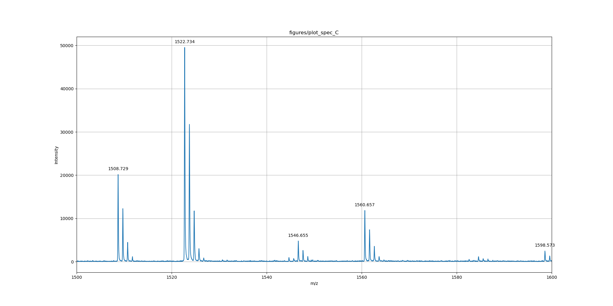
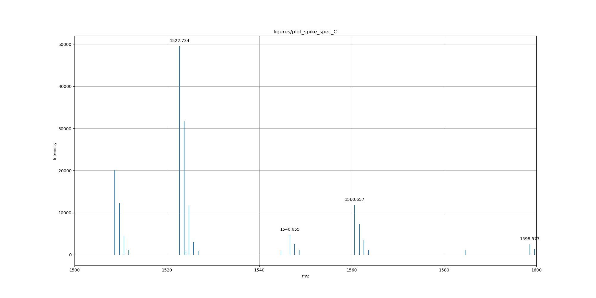
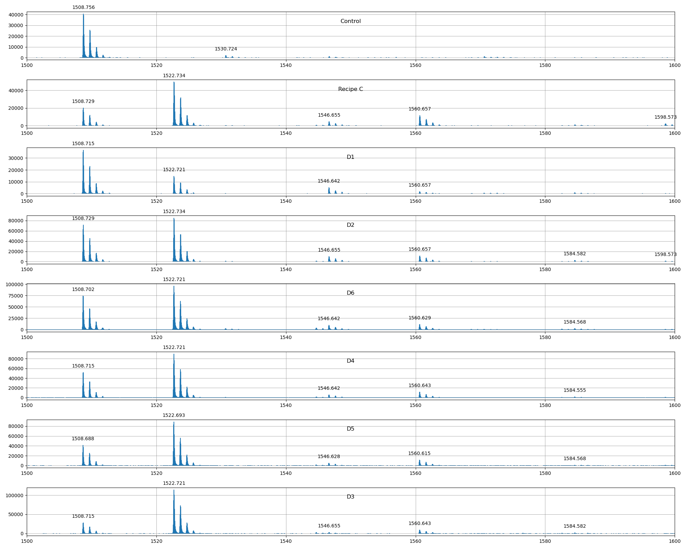
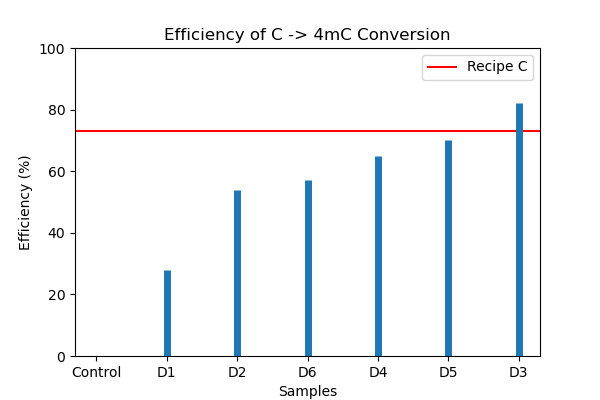
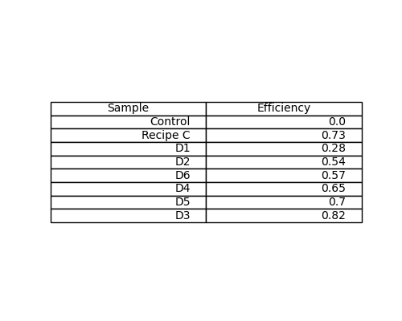

# ms_peaks
Mass Spectrum Primitives and Functions to Manipulate Raw Mass Spectrum Data Files


## ms_peaks.py

A python library to read and manipulate raw text or mzXML files generated by [at least Mahdi] Mass Spectrometers. (Functionality to read raw text and mzXML files is provided by [pyomenms](https://pyopenms.readthedocs.io/en/latest/index.html)) 

### Description of primary data type: Peaks

Peaks are a tuple of two numpy arrays, of which the first array contains values of mz and the
second the values of intensity. The data type is not strictly enforced as a class,
but could easily be implemented as such. (Types are loosely defined in Haskell Style)

- **Type Peaks = ([mz], [Intensity])**

- **Type mz = [Float]**

- **Type Intensity = [Int]**

### Primitives and Functions 
`ms_peaks.py` is reasonably well documented. Below are the functions defined within `ms_peaks.py` 

Also take a look at `examples.py` for examples of usage

```
def Peaks(mz, intensity):
    """
    Peaks :: [mz] -> [Intensity] -> Peaks
    Create a Peaks from lists of mz and intensity
    """

def read_ms_mzXML(file):
    """
    read_ms_mzXML :: mzXML_file -> Peaks
    Read mzXML file format and return Peaks
    """

def read_ms_txt(file):
    """
    read_ms_txt :: file -> Peaks
    Read raw ms file text format and returns Peaks
    """

def is_peaks(peaks):
    """
    is_peaks :: Peaks -> Bool
    If peaks is of type Peaks returns True; otherwise returns False
    """
def check_peaks(peaks):
    """
    check_peaks -> Peaks -> IO
    Only returns False if peaks is not of type Peaks; otherwise does nothing
    """

def get_mz(peaks):
    """
    get_mz :: Peaks -> mz
    Returns mz array of peaks
    """

def get_intensity(peaks):
    """
    get_intensity :: Peaks -> Intensity
    Returns intensity of peaks
    """

def empty_peaks(peaks):
    """
    empty_peaks :: Peaks -> Bool
    Returns True if peaks is empty and False if not
    """

def len_peaks(peaks):
    """
    len_peaks :: Peaks -> Int
    Returns length of peaks
    """

def peak(peaks, nth=0):
    """
    peak:: [peaks] -> peaks
    Return nth peak; default is first peak
    """

def mz(peaks, nth=0):
    """
    mz :: peaks -> mz
    Return nth mz; default is first mz
    """

def intensity(peaks, nth=0):
    """
    intensity :: peaks -> Intensity
    Return nth intensity; default is first intensity
    """

def range_peaks(peaks, mz_base, delta=2):
    """
    range_peaks :: Peaks -> Real -> Int -> Peaks
    Return peaks within the range:  (mz_base - delta) < mz < (mz_base + delta)
    """

def area_peak(peaks, mz_base, dist = 0.5):
    """
    area_peak :: Peaks -> mz -> Real -> Int
    Return sum of intensity within range_peaks(peaks, mz_base, dist)
    """

def call_peaks(peaks, height = 1500):
    """
    call_peaks :: Peaks -> Int -> Peaks
    Calls peaks with intensity > height
    """

def group_peaks(peaks, height = 1500, dist=5):
    """
    group_peaks :: Peaks -> Int -> [Peaks]
    Returns a group of peaks, each grouped of which is within a distance dist of each other
    """

def apex_peaks(peaks, height = 1500, dist = 5):
    """
    apexes :: Peaks -> Peaks
    Returns the peak with the highest intensity for each group returned by group_peaks
    Note: Number of apex peaks can very with selection of height and dist. The defaults work well.
          To optimize, consider modifying to apex_peaks to loop through combinations of paramaters.
    """
```

## fmc.py
This library is specific for functions associated with C -> 4mC. It used in the analysis of mass spectrum Data in the study of C -> 4mC (in DNA oligo 5'-A-G-C-G-A-3')                                                                      
### Sample Usage
```
>>> from fmc import *
from pathlib import Path
data = Path("data")
figures = Path("figures")
Control = read_ms_txt(data/"2024_01_11_C_mer_Control_0_I9_1.txt")
C  = read_ms_txt(data/"2024_01_11_Recipe_C_pH_7.3_K2SO3_950_MeNH2HCl_2024_min_20_0_J8_1.txt")
D1 = read_ms_txt(data/"2024_01_11_10.25_K2S2SO5_666_MAAcid_1400_MeABase_802_min_20_0_K9_1.txt")

>>> c_peak(Control)
(array([1508.756]), array([40647]))

>>> c_peak(C)                                                                    
(array([1508.729]), array([20144]))

>>> fmc_peak(Control)                                                            
(array([], dtype=float64), array([], dtype=int64))

>>> fmc_peak(C)
(array([1522.734]), array([49531]))

>>> efficiency(C)
0.73

>>> efficiency(D1)
0.28

>>> efficiency(Control)
0.0

>>> call_peaks(C)
(array([1508.729, 1509.732, 1510.735, 1522.734, 1523.742, 1524.75 ,
       1525.745, 1546.655, 1547.644, 1560.657, 1561.663, 1562.67 ,
       1598.573]), array([20144, 12262,  4470, 49531, 31754, 11739,  3028,  4781,  2600,
       11830,  7385,  3553,  2467]))
       
>>> get_mz(call_peaks(C))
array([1508.729, 1509.732, 1510.735, 1522.734, 1523.742, 1524.75 ,
       1525.745, 1546.655, 1547.644, 1560.657, 1561.663, 1562.67 ,
       1598.573])
       
>>> get_intensity(call_peaks(C))
array([20144, 12262,  4470, 49531, 31754, 11739,  3028,  4781,  2600,
       11830,  7385,  3553,  2467])
       
>>> area_peak(C, mz(c_peak(C)))
224906

>>> area_peak(C, mz(fmc_peak(C)))
594303

>>> area_peak(C, mz(fmc_peak(C)) + 83)
7395

>>> label_peaks(C)
Apex Peaks: [1508.729 1522.734 1546.655 1560.657 1598.573]
C Peak: 1508.729
C Potassium Peaks: [1546.655]
4mC Peak: 1522.734
4mC Potassium Peaks: [1560.657 1598.573]

>>> for p in c_peak_area_spectrum(C).items(): print(p) # These are all areas under curve:  peak +/- 0.5
...
(0, (1508.729, 224906)) # <- C Apex
(1, (1509.729, 141618)) # <- C 2nd Peak
(2, (1510.729, 55567))  # <- C 3rd Peak
(3, (1511.729, 17962))  # <- C 4th Peak
(4, (1512.729, 8846))
(5, (1513.729, 6568))
(6, (1514.729, 5626))
(7, (1515.729, 5646))
(8, (1516.729, 5777))
(9, (1517.729, 6351))
(10, (1518.729, 6101))
(11, (1519.729, 6330))
(12, (1520.729, 5814))
(13, (1521.729, 7823))
(14, (1522.729, 594424)) # <- 4mC Apex
(15, (1523.729, 396787))
(16, (1524.729, 163437))
(17, (1525.729, 49849))
(18, (1526.729, 17002))
(19, (1527.729, 11320))
(20, (1528.729, 8190))
(21, (1529.729, 7592))
(22, (1530.729, 10110))
(23, (1531.729, 9215))
(24, (1532.729, 7242))
(25, (1533.729, 7523))
(26, (1534.729, 5723))
(27, (1535.729, 6555))
(28, (1536.729, 7683))
(29, (1537.729, 5676))
(30, (1538.729, 8897))
(31, (1539.729, 6704))
(32, (1540.729, 5064))
(33, (1541.729, 10641))
(34, (1542.729, 6828))
(35, (1543.729, 6836))
(36, (1544.729, 13557))
(37, (1545.729, 14160))
(38, (1546.729, 56528)) # <- C-Potassium Apex Peak
(39, (1547.729, 35040))
(40, (1548.729, 17723))
(41, (1549.729, 10501))
(42, (1550.729, 9133))
...
(76, (1584.729, 18389))
(77, (1585.729, 13916))
(78, (1586.729, 10526))
(79, (1587.729, 7412))
(80, (1588.729, 8393))
(81, (1589.729, 8145))
(82, (1590.729, 6913))
(83, (1591.729, 7346)) # <- Putative U-DiSulfide Peak (Need to compare to background)
(84, (1592.729, 6527))
(85, (1593.729, 6818))
(86, (1594.729, 5682))
(87, (1595.729, 6782))
(88, (1596.729, 5836))
(89, (1597.729, 7561))

>>> from example import *
samples_by_ph = [Control, C, D1, D2, D6, D4, D5, D3]
short_labels = ["Control", "Recipe C", "D1", "D2", "D6", "D4","D5","D3"]

>>> plot_spec(C, figures/"plot_spec_C")
>>> plot_spike_spec(call_peaks(C, 750), figures/"plot_spike_spec_C")
>>> plot_multiple_specs(samples_by_ph, short_labels, figures/"plot_multiple_specs")
>>> plot_efficiency(samples_by_ph, short_labels, figures/"plot_efficiency", champ = "Recipe C")
>>> table_efficiency(samples_by_ph, short_labels, figures/"table_efficiency")
```
### Sample Plots and Figures

#### plot_spec(C, figures/plot_spec_C) 
Draws the outline of peaks; Good for all peaks


#### plot_spike_spec(call_peaks(C, 750), figures/plot_spike_spec_C) 
Draws filled in peaks; Good for showing fewer peaks. Only returns peaks with intensity > height, 1500 based upon scipy.find_peaks


#### plot_multiple_specs(samples_by_ph, short_labels, figures/plot_multiple_specs) 
Plots multiple multiple spectrum in one figure


#### plot_efficiency(samples_by_ph, short_labels, figures/plot_efficiency, champ = "Recipe C") 
Creates a figure of C -> 4mC efficiency by sample. `champ` is the prior most efficient sample


#### table_efficiency(samples_by_ph, short_labels, figures/table_efficiency) 
table_efficiency creates a table of efficiency by sample


